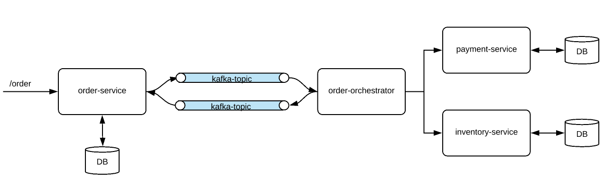

# Saga Pattern - Orchestration

This is a sample project to demo saga pattern.

## Prerequisites:

* Kafka cluster

# High Level Architecture

* Prometheus: http://localhost:9090
* Grafana: http://localhost:3000
* Order service: http://localhost:8080/webjars/swagger-ui/index.html

Dockerize Build:

Payment-service
``
mvn --projects payment-service spring-boot:build-image -Dspring-boot.build-image.imageName=payment-service:0.0.1-SNAPSHOT
``
Verify 
``
docker run -it -p8082:8082 payment-service:0.0.1-SNAPSHOT --spring.datasource.url=jdbc:postgresql://topsy.db.elephantsql.com/obuoolii --spring.datasource.username=obuoolii --spring.datasource.password=J_eTMg19XHPg_jFmecLjehgdhJz4udZK
``
Order-Orchestrator
``
mvn --projects order-orchestrator spring-boot:build-image -Dspring-boot.build-image.imageName=order-orchestrator:0.0.1-SNAPSHOT
``
Verify
``
docker run -it -p8083:8083 -e"SPRING_PROFILES_ACTIVE=prod" order-orchestrator:0.0.1-SNAPSHOT --kafka.username=c21pbGluZy1zdW5iZWFtLTEzOTA4JJereriyCNLjpEaceB-dZfZPqXOo8aIv-TU --kafka.password=YTA5N2RkMTUtMDQ4MS00OTdhLWJmMTItN2Q5OGI3YzZkYWU5
``

``
$ docker login -u "username" --password-stdin <<< "password"
$ docker push "saga-payment" --all-tags &&
``

Heroku build
